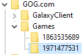
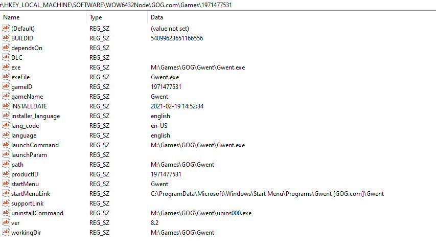
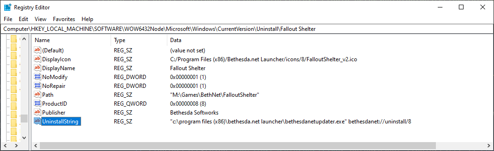

# GameFinder

[](https://github.com/erri120/GameFinder/actions/workflows/ci.yml) [](https://www.nuget.org/packages/GameFinder/)

.NET 5 library for finding games on Windows. The following stores are support:

- [Steam](#steam)
- [GOG](#gog)
- [Bethesda.net Launcher](#bethesdanet-launcher)
- [Epic Games Store](#epic-games-store)
- [Xbox Game Pass](#xbox-game-pass-uwp) (UWP apps, see [Finding Xbox Games](#how-to-find-xbox-game-pass-uwp-games) for more information)
- [Origin](#origin)

## When to use this Library

Most of the time you develop a tool for a single game and then you just find the game using registry keys. This library was made for tools which need to find multiple different games from different stores. I originally wrote most of the code for [Wabbajack](https://github.com/wabbajack-tools/wabbajack) but decided to move the code to its own repository so other tools like [Synthesis](https://github.com/mutagen-modding/Synthesis) can also make use of it.

## Usage

```c#
var steamHandler = new SteamHandler();
steamHandler.FindAllGames();
foreach (var steamGame in steamHandler.Games)
{
    Console.WriteLine($"{steamGame} is located at {steamGame.Path}");
}
```

## Supported Stores

The following sections contain information on how to use a specific handler and what it does in the background. If you only need to know how to use the handler then you just need to read the [Usage](#usage). If you want to know how it works, how others have implemented it or you just want to know how to do it manually; look at the "_How to find_" sub-section.

### Steam

#### How to find Steam Games

Implementation can be found in `GameFinder.StoreHandlers.Steam`: [SteamHandler](GameFinder.StoreHandlers.Steam/SteamHandler.cs).

Steam games can be easily found by searching through _"Steam Universes"_. An Universe is simply a folder where you install Steam games. You can find all Universes by parsing some configuration files in the Steam folder. We can get the Steam folder by opening the registry key `HKEY_CURRENT_USER\Software\Valve\Steam` and getting the `SteamPath` value.

Steam changed the format of their configuration files multiple times which is why you have to differentiate between different formats:

##### Steam Versions before 1623193086 (2021-06-08)

The `config/config.vdf` file uses Valve's KeyValue format which is similar to JSON. What we want to look for are these `BaseInstallFolder_X` values which point to a Universe folder.

```vdf
"InstallConfigStore"
{
	"Software"
	{
		"Valve"
		{
			"Steam"
			{
				"BaseInstallFolder_1"		"F:\\SteamLibrary"
				"BaseInstallFolder_3"		"E:\\SteamLibrary"
			}
		}
	}
}
```

The `steamapps/libraryfolders.vdf` uses the same type of formatting as above. The lines with a numeric key point to a Universe folder. These numbers should match up with the `BaseInstallFolder_X` values in `config/config.vdf`.

```vdf
"LibraryFolders"
{
	"TimeNextStatsReport"		"1623187700"
	"ContentStatsID"		"-8832980547670729777"
	"1"		"F:\\SteamLibrary"
	"3"		"E:\\SteamLibrary"
}
```

Both `config/config.vdf` and `steamapps/libraryfolders.vdf` are parsed for possible Universe locations. Steam should keep these files synced but there have been some user reports of this not happening.

##### Steam Versions after 1623193086 (2021-06-08)

In the new format only `steamapps/libraryfolders.vdf` contains the Universe locations:

```vdf
"libraryfolders"
{
	"contentstatsid"		"1616900521946793171"
	"1"
	{
		"path"		"M:\\SteamLibrary"
		"label"		""
		"mounted"		"1"
		"contentid"		"5393764431939341339"
	}
	"2"
	{
		"path"		"E:\\SteamLibrary"
		"label"		""
		"mounted"		"1"
		"contentid"		"6734528685854492248"
	}
}
```

They now store an array of objects instead of strings which contain additional information like `label` and `mounted`.

##### Parsing Steam's appmanifest files

The `steamapps` subdirectory contains the `appmanifest_*.acf` files we need. `.acf` files have the same KeyValue format as `.vdf` files so parsing is very easy:

```vdf
"AppState"
{
	"appid"		"8930"
	"Universe"		"1"
	"LauncherPath"		"C:\\Program Files (x86)\\Steam\\steam.exe"
	"name"		"Sid Meier's Civilization V"
	"StateFlags"		"4"
	"installdir"		"Sid Meier's Civilization V"
	"LastUpdated"		"1600350073"
	"UpdateResult"		"0"
	"SizeOnDisk"		"9235434479"
	"buildid"		"4390913"
	"LastOwner"		"76561198110222274"
	"BytesToDownload"		"20736"
	"BytesDownloaded"		"20736"
	"BytesToStage"		"26039"
	"BytesStaged"		"26039"
}
```

Important in this file are the `appid`, `name` and `installdir` fields. Note: `installdir` is the name of the folder in `Universe/steamapps/common/` where the game is installed. It is not absolute but relative to the `common` folder.

### GOG

#### How to find GOG Games

Implementation can be found in `GameFinder.StoreHandlers.GOG`: [GOGHandler](GameFinder.StoreHandlers.GOG/GOGHandler.cs).

GOG stores all information in the registry. This can either be at `HKEY_LOCAL_MACHINE\Software\GOG.com\Games` or `HKEY_LOCAL_MACHINE\Software\WOW6432Node\GOG.com\Games`. Simply open the registry key and get all sub-key names. Each sub-key in `GOG.com\Games` is an installed game with the ID being the name of the sub-key:



Now you can iterate over all sub-keys to get all the information you need:



Important fields are `path`, `gameID` and `gameName`.

### Bethesda.net Launcher

#### How to find Bethesda.net Launcher Games

Implementation can be found in `GameFinder.StoreHandlers.BethNet`: [BethNetHandler](GameFinder.StoreHandlers.BethNet/BethNetHandler.cs).

Finding games installed with the Bethesda.net Launcher was very rather tricky because there are no config files you can parse or simple registry keys you can open. I ended up using a similar method to the GOG Galaxy Bethesda.net plugin by TouwaStar: [GitHub](https://github.com/TouwaStar/Galaxy_Plugin_Bethesda). The interesting part is the `_scan_games_registry_keys` function in [`betty/local.py`](https://github.com/TouwaStar/Galaxy_Plugin_Bethesda/blob/master/betty/local.py#L154):

1) open the uninstaller registry key at `HKEY_LOCAL_MACHINE\SOFTWARE\WOW6432Node\Microsoft\Windows\CurrentVersion\Uninstall`
2) iterate over every sub-key:
   - find the sub-keys that open the Bethesda Launcher with `bethesdanet://uninstall/` as an argument



With this you can find all games installed via Bethesda.net. The important fields are `DisplayName`, `ProductID` (64bit value) and `Path`.

### Epic Games Store

#### How to find Epic Games Store Games

Implementation can be found in `GameFinder.StoreHandlers.EGS`: [EGSHandler](GameFinder.StoreHandlers.EGS/EGSHandler.cs).

The Epic Games Store uses manifest files, similar to Steam, which contain all information we need. The path to the manifest folder can be found by opening the registry key `HKEY_CURRENT_USER\SOFTWARE\Epic Games\EOS` and getting the `ModSdkMetadataDir` value. Inside the manifest folder you will find `.item` files which are actually just JSON files with a different extension.

See [`8AAFB83044E76B812D3D8C9652E8C13C.item`](GameFinder.Tests/files/8AAFB83044E76B812D3D8C9652E8C13C.item) for an example file. Important fields are `InstallLocation`, `DisplayName` and `CatelogItemId`.

### Xbox Game Pass (UWP)

#### How to find Xbox Game Pass (UWP) Games

Implementation can be found in `GameFinder.StoreHandlers.Xbox`: [XboxHandler](GameFinder.StoreHandlers.Xbox/XboxHandler.cs).

These games are installed through the Xbox Game Pass app or the Windows Store. These games are UWP packages and in a UWP container. I had to use the Windows 10 SDK to get all packages:

```c#
internal static IEnumerable<Package> GetUWPPackages()
{
   var manager = new PackageManager();
   var user = WindowsIdentity.GetCurrent().User;
   var packages = manager.FindPackagesForUser(user.Value)
       .Where(x => !x.IsFramework && !x.IsResourcePackage && x.SignatureKind == PackageSignatureKind.Store)
       .Where(x => x.InstalledLocation != null);
   return packages;
}
```

Since the packages uses the Windows 10 SDK I had to change the project settings to reflect that:

```xml
<Project Sdk="Microsoft.NET.Sdk">
 <PropertyGroup>
     <TargetFrameworks>net5.0-windows10.0.18362.0;netstandard2.1</TargetFrameworks>
 </PropertyGroup>
 
 <ItemGroup Condition="'$(TargetFramework)' == 'netstandard2.1'">
     <Reference Include="Windows, Version=255.255.255.255, Culture=neutral, PublicKeyToken=null, ContentType=WindowsRuntime">
         <HintPath>C:\Program Files (x86)\Windows Kits\10\UnionMetadata\10.0.18362.0\Windows.winmd</HintPath>
     </Reference>
 </ItemGroup>
</Project>
```

Since the query from above will get us all UWP packages, some of those might not be Xbox games. The solution to this is getting a list of all games the current user owns on Xbox Game Pass which we can get using the Xbox REST API:

```
https://titlehub.xboxlive.com/users/xuid({_xuid})/titles/titlehistory/decoration/details
```

The main problem is getting the `xuid` parameter. This library can accept the `xuid` parameter in the `XboxHandler` constructor and get the title history. Using the title history the library will filter out all installed UWP packages that are not present in the title history.

The following information is on how to get the `xuid` parameter:

Follow [this](https://docs.microsoft.com/en-us/advertising/guides/authentication-oauth-live-connect) guide on how to get started with Live Connect Authentication. After the user logged in with OAuth at `https://login.live.com/oauth20_authorize.srf` you can get the following parameters from the redirection url: `#access_token`, `refresh_token`, `expires_in`, `token_type` and `user_id`.

The access token is needed to authenticate at `https://user.auth.xboxlive.com/user/authenticate` by doing a POST with the following data (remember to use content-type `application/json`):

```json
{
   "RelyingPart": "http://auth.xboxlive.com",
   "TokenType": "JWT",
   "Properties": {
      "AuthMethod": "RPS",
      "SiteName": "user.auth.xboxlive.com",
      "RpsTicket": "<access_token>"
   }
}
```

(DTO: [AuthenticationRequest](GameFinder.StoreHandlers.Xbox/DTO/AuthenticationRequest.cs))

The response is also JSON:

```json
{
   "Token": "the-only-important-field"
}
```

(DTO: [AuthorizationData](GameFinder.StoreHandlers.Xbox/DTO/AuthorizationData.cs))

Now you need to authorize and get the final token. This is another POST request with JSON data to `https://xsts.auth.xboxlive.com/xsts/authorize`:

```json
{
   "RelyingParty": "http://xboxlive.com",
   "TokenType": "JWT",
   "Properties": {
      "SandboxID": "RETAIL",
      "UserTokens": ["<token you got from the previous response>"]
   }
}
```

(DTO: [AuthorizationRequest](GameFinder.StoreHandlers.Xbox/DTO/AuthorizationRequest.cs))

The response is of course also in JSON:

```json
{
   "DisplayClaims": {
      "xui": [
         {
            "uhs": "",
            "usr": "",
            "utr": "",
            "prv": "",
            "xid": "THIS IS THE XUID TOKEN",
            "gtg": ""
         }
      ]
   }
}
```

(DTO: [AuthorizationData](GameFinder.StoreHandlers.Xbox/DTO/AuthorizationData.cs))

After all this requesting you finally have the xuid you can use in the constructor.

### Origin

#### How to find Origin Games

Implementation can be found in `GameFinder.StoreHandlers.Origin`: [OriginHandler](GameFinder.StoreHandlers.Origin/OriginHandler.cs).

There are 2 components to finding Origin Games. Both can actually be used separately or together with the only difference being the quantity and quality of the data. Depending on your use-case one or the other might look more promising or you just want all the information and use both. The first component uses the locally found Manifests to find out where the game is installed and has access to some extra information about how to run it. The other component uses the Origin API to get massive amounts of data about the game: how it is represented in the store, what content is related to it and much more. I suggest looking at both methods and then deciding what you actually need for your own project.

Regardless of what you choose, both start by looking at `.mfst` files in `C:\ProgramData\Origin\LocalContent`. These files contain a single query string that can be parsed for useful information. The important field is `id`.

##### Parsing Origin's Manifests

Taking a look at the query string in the `.mfst` files, we need the `dipinstallpath` and `id` fields. With the former pointing to the installation of the game. Do note that not all manifests contain the `dipinstallpath` value because every DLC, Addon or other downloadable content has its own Manifest.

After you found the the installation folder there is a subfolder `__Installer` that contains a `installerdata.xml` file which is the manifest generated by the _EAInstaller_:

```xml
<?xml version='1.0' encoding='utf-8'?>
<DiPManifest version="4.0">
  <!--Manifest generated by the EAInstaller-4.05.02.00-->
  <buildMetaData>
    <featureFlags allowMultipleInstances="0" autoUpdateEnabled="1" dynamicContentSupportEnabled="0" enableDifferentialUpdate="1" enableOriginInGameAPI="0" forceTouchupInstallerAfterUpdate="1" languageChangeSupportEnabled="1" treatUpdatesAsMandatory="1" useGameVersionFromManifest="1" />
    <gameVersion version="1.8.2.48475" />
    <requirements osMinVersion="6.0" osReqs64Bit="false" />
  </buildMetaData>
  <contentIDs>
    <contentID>1007968</contentID>
    <contentID>1011575</contentID>
    <contentID>1011576</contentID>
    <contentID>1011577</contentID>
    <contentID>1010268</contentID>
    <!-- rest omitted -->
     
  </contentIDs>
  <gameTitles>
    <gameTitle locale="en_US">Battlefield 4™</gameTitle>
     <!-- rest omitted -->
     
  </gameTitles>

   <runtime>
      <launcher uid="1-2">
         <name locale="en_US">Battlefield 4™ (x64)</name>
         <!-- rest omitted -->
         <filePath>[HKEY_LOCAL_MACHINE\SOFTWARE\EA Games\Battlefield 4\Install Dir]BFLauncher.exe</filePath>
         <parameters />
         <executeElevated>0</executeElevated>
         <requires64BitOS>1</requires64BitOS>
         <trial>0</trial>
      </launcher>
      <launcher uid="2-2">
         <name locale="en_US">Battlefield 4™ (x86)</name>
         <!-- rest omitted -->
         <filePath>[HKEY_LOCAL_MACHINE\SOFTWARE\EA Games\Battlefield 4\Install Dir]BFLauncher_x86.exe</filePath>
         <parameters />
         <executeElevated>0</executeElevated>
         <requires64BitOS>0</requires64BitOS>
         <trial>0</trial>
      </launcher>
   </runtime>
   
   <!-- rest omitted -->
</DiPManifest>
```

##### Using the Origin API

We take a look at the `C:\ProgramData\Origin\LocalContent` folder and find folders containing `.mfst` files. These `.mfst` files contain the ID that we can use with Origin API: `https://api{N}.origin.com/ecommerce2/public/{ID}/en_US`. As of time of writing (2021-07-06) there are only 4 hosts available:

- `api1.origin.com`
- `api2.origin.com`
- `api3.origin.com`
- `api4.origin.com`

The ID can found in the `.mfst` file by parsing the query string and getting the `id` value: `https://api3.origin.com/ecommerce2/public/Origin.OFR.50.0001131/en_US`. The resulting JSON data can then be parsed for more information:

```json
{
   "itemId": "Origin.ITM.50.0001046",
   "storeGroupId": "Origin",
   "financeId": "1032112",
   "defaultLocale": "DEFAULT",
   "baseAttributes": {
      "platform": "PCWIN"
   },
   "publishing": {
      "publishingAttributes": {
         "contentId": "1000659",
         "greyMarketControls": true,
         "isDownloadable": true,
         "gameDistributionSubType": "Normal Game",
         "originDisplayType": "Full Game",
         "isPublished": true
      },
      "softwareList": {
         "software": [
            {
               "softwareId": "Origin.SFT.50.0000073",
               "fulfillmentAttributes": {
                  "achievementSetOverride": "68222_74369_50844",
                  "cloudSaveConfigurationOverride": "<saveFileCriteria>\n<exclude order=\"0\">%Documents%/BioWare/Dragon Age Inquisition/Save/ProfileOptions_profile</exclude>\n<include order=\"1\">%Documents%/BioWare/Dragon Age Inquisition/Save/*.DAS</include>\n<include order=\"2\">%Documents%/BioWare/Dragon Age Inquisition/Save/ProfileOptions</include>\n</saveFileCriteria>",
                  "commerceProfile": "bfx",
                  "downloadPackageType": "DownloadInPlace",
                  "enableDLCuninstall": false,
                  "executePathOverride": "[HKEY_LOCAL_MACHINE\\SOFTWARE\\BioWare\\Dragon Age Inquisition\\Install Dir]\\DragonAgeInquisition.exe",
                  "oigClientBehavior": "Default",
                  "installationDirectory": "Dragon Age Inquisition",
                  "installCheckOverride": "[HKEY_LOCAL_MACHINE\\SOFTWARE\\BioWare\\Dragon Age Inquisition\\Install Dir]\\DragonAgeInquisition.exe",
                  "monitorInstall": true,
                  "monitorPlay": true,
                  "multiPlayerId": "1000659",
                  "processorArchitecture": "64-bit",
                  "showSubsSaveGameWarning": true
               },
               "softwarePlatform": "PCWIN"
            }
         ]
      }
   },
   "mdmHierarchies": {
      "mdmHierarchy": [
         {
            "mdmMasterTitle": {
               "masterTitleId": 74369,
               "masterTitle": "DRAGON AGE: INQUISITION"
            },
            "mdmFranchise": {
               "franchiseId": 68222,
               "franchise": "Dragon Age"
            },
            "type": "Primary"
         }
      ]
   },
   "firstParties": {
      "firstParty": [
         {
            "partner": "Steam",
            "partnerIdType": "Content ID",
            "partnerId": "1222690"
         },
         {
            "partner": "Steam",
            "partnerIdType": "Offer ID",
            "partnerId": "1255340"
         }
      ]
   },
   "itemName": "Dragon Age: Inquisition - Game of the Year - PCDD - ROW (Origin.com)",
   "offerType": "Base Game",
   "offerId": "Origin.OFR.50.0001131",
   "projectNumber": "313365"
}
```

## Contributing

See [CONTRIBUTING](CONTRIBUTING.md) for more information.

## License

GPLv3.0, see [LICENSE](LICENSE) for more information.
